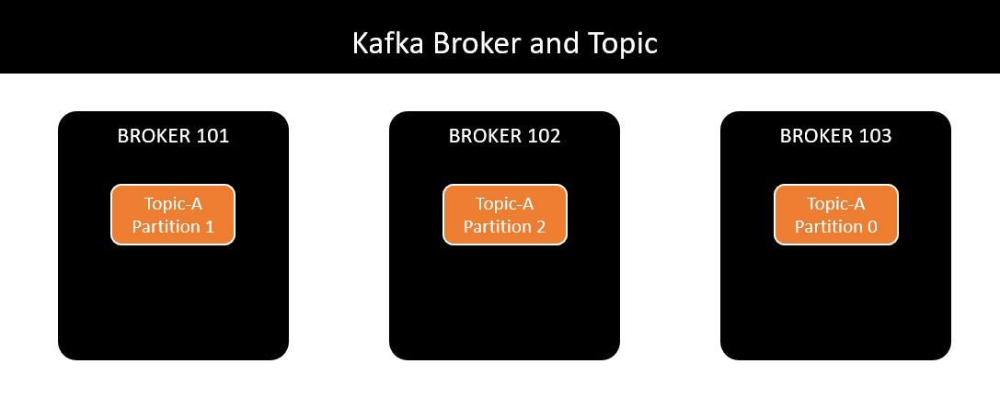

# QuizQueue Project

## Overview

QuizQueue is a microservices-based application designed to manage quizzes, flashcards, notifications, and user accounts. The project is built using Spring Boot and Spring Cloud, leveraging various technologies such as OAuth2 for authentication, Kafka for messaging, and Elasticsearch for search capabilities.

## Prerequisites

- Java 21 or newer
- Maven
- Docker (for running services via Docker Compose)

## Architecture
- Distributed system (Zookeeper, Kafka, Spring-cloud)
- Load Balancer, Gateway, Circuit breaker, Pub/Sub
- MVC, Repository pattern, Builder pattern

## Insight tech
- Redis
- NoSQL

## Docker
- Thanks elkozmon for the opensource Zookeeper UI.
- You guys can find him here [Github-repo](https://github.com/elkozmon/zoonavigator)
- Easily run this project as follows:<br>
``` docker compose up -d ```
- And use this to view the UI at <i>localhost:9000</i>  [Zookeeper-UI](http://localhost:9000)

## Kafka Architecture



- Use Kafka console producer for bitnami/image (Alternative, we can use [Offset Explorer](https://www.kafkatool.com/)) <br>
```docker exec -it {container-id} /bin/kafka-console-producer --bootstrap-server kafka:9092 --topic {topic-name}```